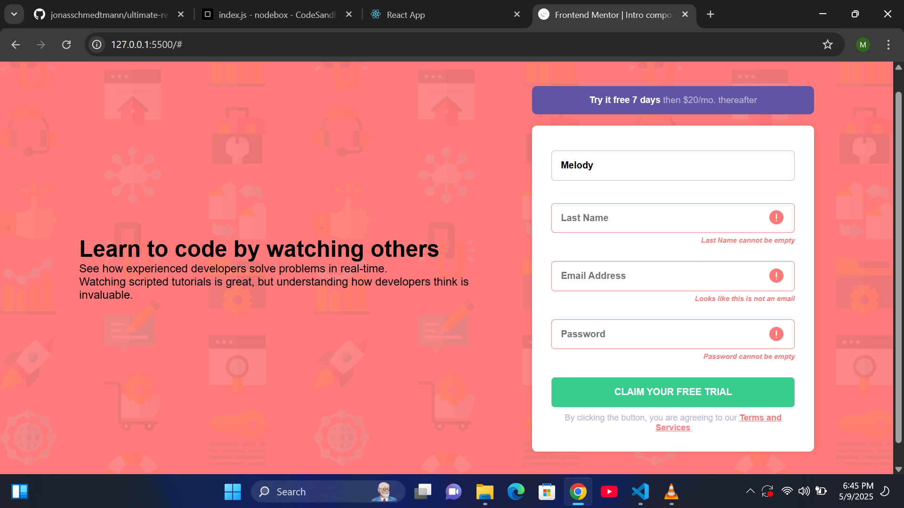

# Frontend Mentor - Intro component with sign up form solution

This is a solution to the [Intro component with sign up form challenge on Frontend Mentor](https://www.frontendmentor.io/challenges/intro-component-with-signup-form-5cf91bd49edda32581d28fd1). 

## Table of contents

- [Overview](#overview)
  - [The challenge](#the-challenge)
  - [Screenshot](#screenshot)
  - [Links](#links)
- [My process](#my-process)
  - [Built with](#built-with)
  - [What I learned](#what-i-learned)
  - [Continued development](#continued-development)
- [Author](#author)
- [Acknowledgments](#acknowledgments)

## Overview

### The challenge

Users should be able to:

- View the optimal layout for the site depending on their device's screen size
- See hover states for all interactive elements on the page
- Receive an error message when the `form` is submitted if:
  - Any `input` field is empty. The message for this error should say *"[Field Name] cannot be empty"*
  - The email address is not formatted correctly (i.e. a correct email address should have this structure: `name@host.tld`). The message for this error should say *"Looks like this is not an email"*

### Screenshot

### Links

- Solution URL: [Add solution URL here](https://github.com/devmelody/Form-validation-1)
- Live Site URL: [Add live site URL here](https://devmelody.github.io/Form-validation-1)

## My process

### Built with

- Semantic HTML5 markup
- CSS custom properties
- Flexbox

### What I learned
Hmm, I learnt a whole lot! Patience most importantly. I had a lot of headaches worrying about why my Js code wasn't working. The issue was mostly with JS though.
### Continued development

I'll be working on another form validation project and I hope to have less headaches this time.

### Useful resources

## Author
- LinkedIn - [melCamelCase](https://linkedin.com/in/melcamelcase)
- Frontend Mentor - [@devmelody](https://frontendmentor.io/profile/devmelody)
- Twitter - [@melCamelCase](https://x.com/melcamelcase)

## Acknowledgments

Myself again.
